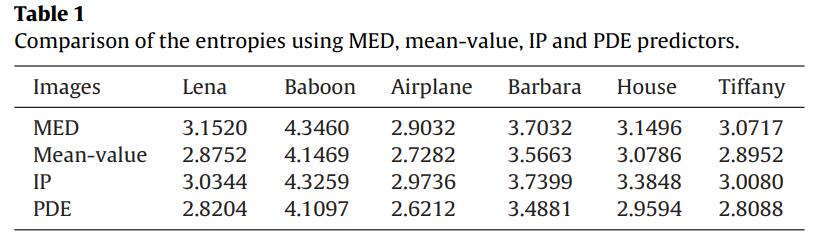
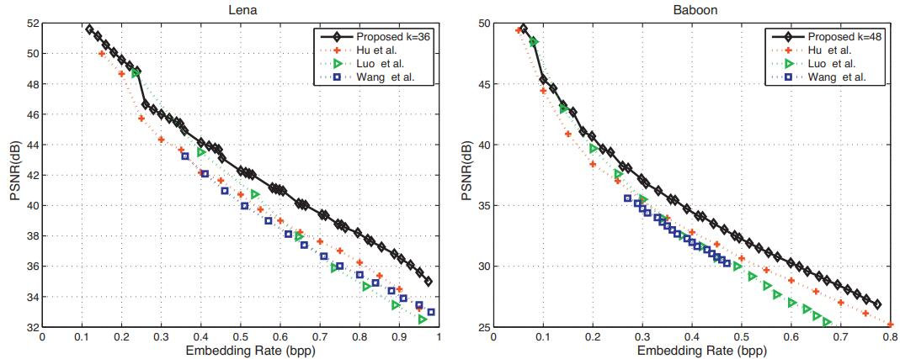

PDE predictor based PEE
=======


This repo is implementation for the accepted paper "[Reversible data hiding based on PDE predictor](https://www.sciencedirect.com/science/article/pii/S0164121213001374)" (JSS 2013).


## How to run

```
go to Ou_JSS_PEE
run Ou_Sort_pde.m
```

## Experimental Results

<p align="center">     </p>
<p align="center"> Figure 1:  Comparison of the predictors. </p>

<p align="center">     </p>
<p align="center"> Figure 2:  Performance evaluation.</p>


## Environment
Matlab 2016b <br>


## Acknowledgement
This work was supported in part by 973 Program (2011CB302204), National Natural Science Funds for Distinguished Young Scholar (61025013), National NSF of China (61073159, 61272355), PCSIRT (IRT 201206), Fundamental Research Funds for the Central Universities (2012JBM042).


## Citation
If you find this work useful for your research, please cite
```
@article{OU20132700,
title = {Reversible data hiding based on PDE predictor},
journal = {Journal of Systems and Software},
volume = {86},
number = {10},
pages = {2700-2709},
year = {2013},
issn = {0164-1212},
doi = {https://doi.org/10.1016/j.jss.2013.05.077},
author = {Bo Ou and Xiaolong Li and Yao Zhao and Rongrong Ni},
}
```

## License and Copyright
The project is open source under MIT license (see the ``` LICENSE ``` file).

